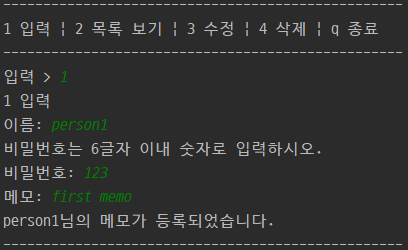
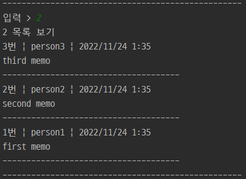
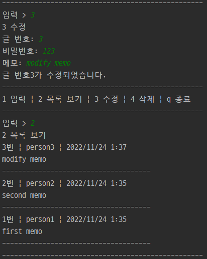
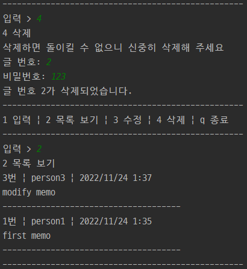
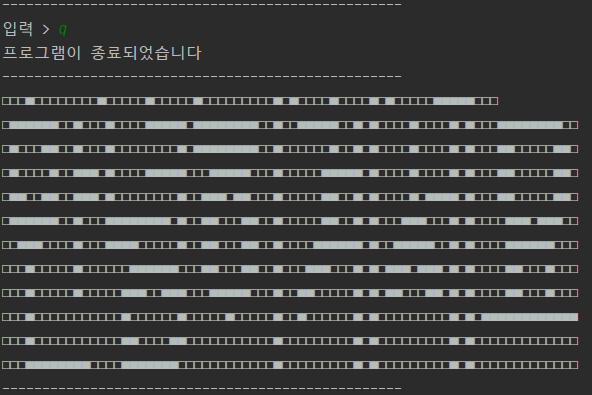

# README


### 📌 프로젝트 소개

> 22.11.23

Java를 통해 메모장을 구현합니다.

- 메모 추가
  => 이름, 비밀번호 메모 입력 시, 저장

- 목록 보기
  => 저장된 메모 모두 출력 (작성 최신 순)

- 메모 수정
  => 비밀번호 확인 후 해당 메모 수정, 작성시간 변경

- 메모 삭제
  => 비밀번호 확인 후 해당 메모 삭제

- 프로그램 종료

  <br>

### ✨ 개발 인원 및 역할

5명

성루비 : 팀장, 메모 수정, 목록 보기

김송미 : 팀원, 메모 추가

김시원 : 팀원, 메모 삭제

김태웅 : 팀원, 클래스 변수, 클래스 메소드 생성

최승호 : 팀원, 목록 보기, 프로젝트 실행(main)

<br>

### 📌 사용된 기술

프론트, 백, DB : Java

<br>

### 📌 프레임워크

```
-------------------------------------------
1 입력 | 2 목록 보기 | 3 수정 | 4 삭제 | q 종료
-------------------------------------------
1 입력
이름 / 비밀번호 / 메모 형식으로 입력해주세요. => split / 각각을 필드에 넣어줘야함
이름: 
비밀번호는 6글자이내 뭐시로~
비밀번호: 
메모: 
-------------------------------------------
2 목록 보기
메모리스트
1 잠자기 (성루비, 2022-11-23)
2 잠자기 (성루비, 2022-11-23)
3 잠자기 (성루비, 2022-11-23)
-------------------------------------------
3 수정
입력 > 5
글이 존재하지 않습니다.
입력 > 1
비밀번호: 
비밀번호가 일치하지 않습니다.
입력 > 1
비밀번호: 
1번이 밥먹기로 수정되었습니다.
-------------------------------------------
4 삭제
입력 > 5
글이 존재하지 않습니다.
입력 > 1
비밀번호: 
비밀번호가 일치하지 않습니다.
입력 > 1
비밀번호: 
1번 잠자기가 삭제되었습니다.
-------------------------------------------
q 종료
입력 > q
프로그램이 종료되었습니다.
```

<br>

### 📌 Field

| Memo Field  |     Type     |
| :---------: | :----------: |
|   글 번호   |    int id    |
| 작성자 이름 | string name  |
|  비밀번호   | int password |
|   게시글    | string post  |
|   작성일    | string date  |

<br>

### 📌 Method

|    기능    |                            Method                            |
| :--------: | :----------------------------------------------------------: |
| 메모리스트 |                getMemoList() / showMemoList()                |
| 메모 추가  | saveMemo(String name, int password, String post) / postMemo(...) |
| 메모 수정  | editMemo(int id, int password, String newPost) / changeMemo(...) |
| 메모 삭제  |       removeMemo(int id, int password) / delMemo(...)        |

<br>

### 🔥 결과

#####  👉 메모 등록 (1 입력)




##### 👉 메모리스트 (2 입력)




##### 👉 메모 수정 (3 입력)




##### 👉 메모 삭제 (4 입력)




##### 👉 종료 (q 입력)


